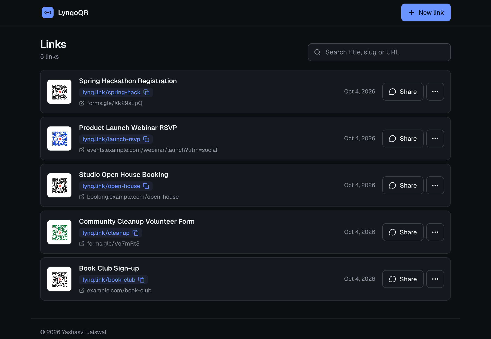
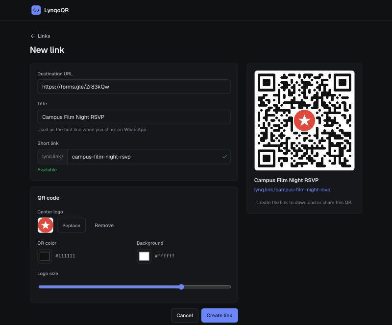
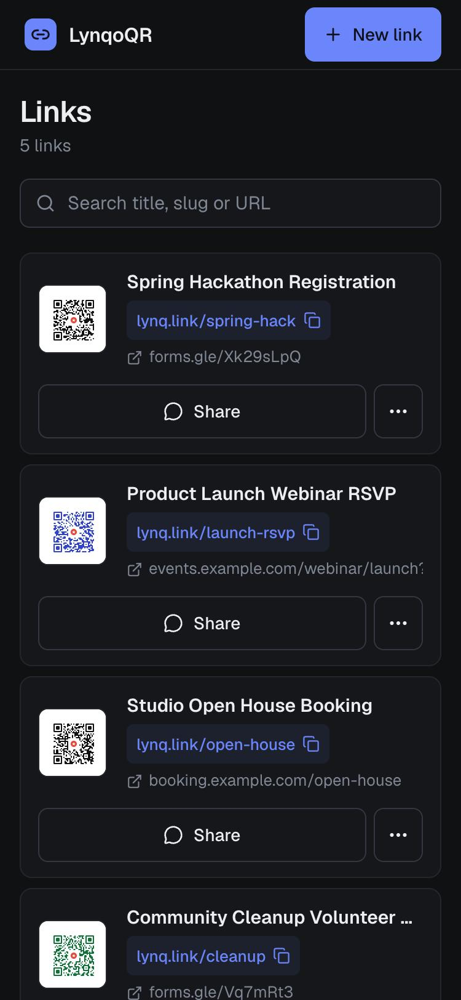

# LynqoQR

Turn a promo link (Google Form, event page, booking page) into a **short link** and a **QR code with your logo in the center**, keep every one in a library, and **share the QR to WhatsApp** in one tap.

| Links | New link |
|---|---|
|  |  |



## Live deployment

**https://lynqoqr.yashasvi-jaiswal-2006.workers.dev**

The deployment is private (behind Cloudflare Access) because it writes to my own short-link storage. **You need to ask me for access:** message me on GitHub ([@yashjswl](https://github.com/yashjswl)) with the email address you want allowed. To use LynqoQR yourself, deploy your own copy with the steps below.

## Features

- Create a short link with a custom slug and a live availability check.
- QR code with a center logo, custom colors and logo size. Error correction is set to high so it still scans.
- Your last uploaded logo is remembered and used for the next QR until you upload a different one.
- Library with search, edit, delete, QR download and caption copy.
- WhatsApp share: on a phone it opens the share sheet with the QR image and the caption `Title`, newline, `Short Link: <url>`. On desktop it downloads the QR, copies the caption and opens WhatsApp.
- Light and dark themes, mobile-first.

## How it works

```
Browser ──► LynqoQR Worker (React app + Hono API)
              ├─ KV  link-short : slug -> long URL      (the short links)
              └─ D1  entries    : title, QR options, logo, timestamps
Visitor ──► Redirect Worker on your short domain ──reads── KV link-short ──► 302 to the long URL
```

LynqoQR never serves redirects itself. It writes `slug -> URL` pairs into a Workers KV namespace, and a small separate Worker on your short domain reads that namespace and redirects. That Worker is in [`docs/redirect-worker.js`](docs/redirect-worker.js):

```js
export default {
  async fetch(request, env) {
    const url = new URL(request.url);
    const shortname = url.pathname.slice(1).toLowerCase();
    if (!shortname) return fetch(request);           // domain root: normal website
    try {
      const value = await env.redirects.get(shortname);
      if (value === null) return fetch(request);     // unknown key: normal website
      return Response.redirect(value, 302);
    } catch (err) {
      return fetch(request);
    }
  }
};
```

Slugs are lowercased by both sides, so a short link works whatever case you type it in.

## Stack

Vite + React + TypeScript, Hono on Cloudflare Workers (serving the built app as static assets), D1, Workers KV, [`qr-code-styling`](https://github.com/kozakdenys/qr-code-styling). Access control is Cloudflare Access; the API also verifies the Access JWT when configured.

## Run your own

1. `npm install`
2. Create the resources: a KV namespace for the short links (the one your redirect Worker reads) and `npx wrangler d1 create lynqoqr`.
3. `cp apps/api/wrangler.toml apps/api/wrangler.local.toml` (gitignored) and fill in the KV namespace id, the D1 database id and `SHORT_BASE_URL` (the public domain that serves your short links, no trailing slash).
4. `npm run db:local` then `npm run dev:api` (serves the built app and API on http://localhost:8787; run `npm run build` first). `npm run dev:web` gives hot reload and proxies `/api`.
5. Deploy: `npm run db:remote -w apps/api`, then `npm run deploy`.
6. Put the Worker's domain behind Cloudflare Access and set `ACCESS_TEAM_DOMAIN` and `ACCESS_AUD` in `wrangler.local.toml` so the API verifies the login token. Without Access, anyone who finds the URL can create and delete links, so don't skip this.

## Project layout

- `apps/web`: React app. `apps/api`: Worker, D1 migrations. `docs/`: screenshots and the redirect Worker.
- `PRODUCT.md` and `apps/web/DESIGN.md` record the product context and the design system.

&copy; 2026 Yashasvi Jaiswal
